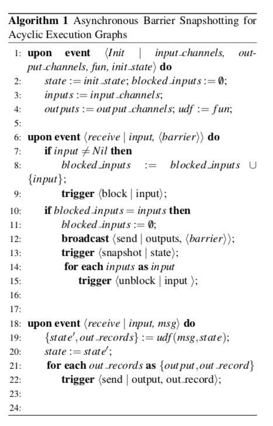
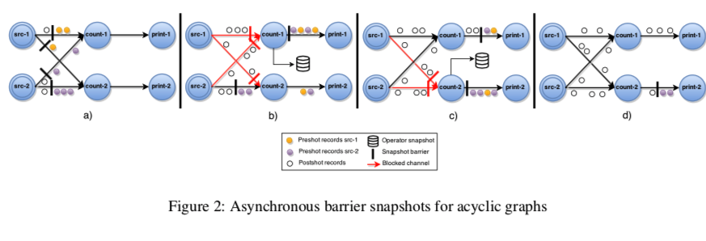
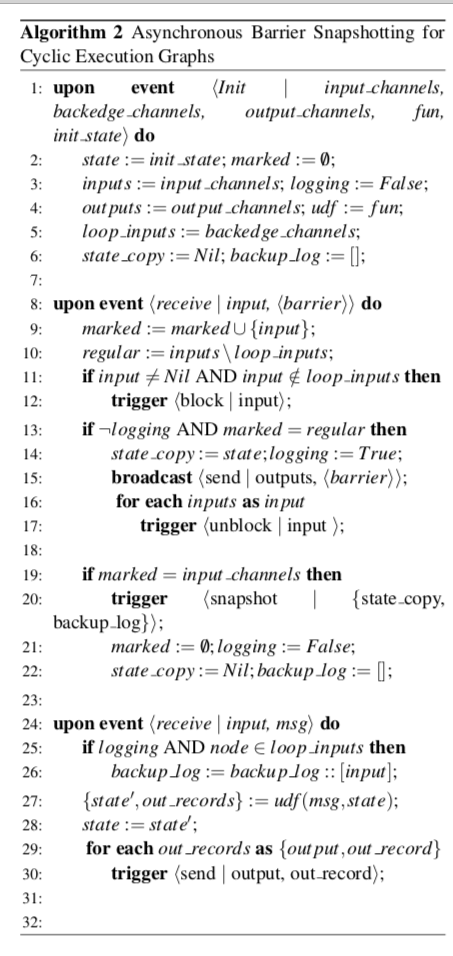
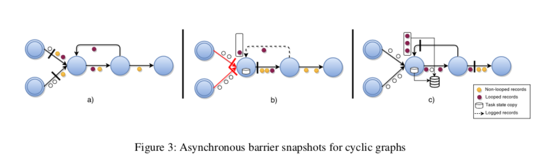
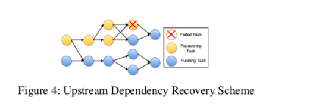

# 分布式数据流的轻量级异步快照

## 1 摘要

分布式有状态流处理支持在云中部署和执行大规模连续计算，目标是低延迟和高吞吐量。这种模式最根本的挑战之一是在潜在的失败条件下提供处理保证。
现有方法依赖于可用于故障恢复的周期性全局状态快照。这些方法有两个主要缺点：

* 首先，它们经常会阻塞整体计算，这会影响数据注入。

* 其次，他们将运行中的所有记录与操作状态一起持久存储，从而导致所得的快照大于所需的快照。

在这项工作中，我们提出了异步barrier快照（ABS- Asynchronous Barrier Snapshotting），这是一种适用于现代数据流执行引擎的轻量级算法，可最大限度地减少空间需求。 
ABS仅保留非循环执行拓扑上的运算符状态，同时保留循环数据流的最小记录日志。在Apache Flink上实现了ABS，这是一个支持有状态流处理的分布式分析引擎。
测试表明，该算法不会对执行产生重大影响，保持线性可伸缩性并且频繁的快照也表现良好。

## 2 简介

分布式数据流处理是数据密集型计算的新兴范例，它允许对大量数据进行连续计算，以低端到端延迟为目标，同时保证高吞吐量。
一些要求实时应用程序可以从Apache Flink 和Naiad 等数据流处理系统中受益，特别是在实时分析领域（例如预测分析和复杂事件处理）。
容错在这样的系统中是至关重要的，因为在大多数现实世界的用例中都不能避免发生故障。当前已知的方法，保证有状态处理系统上的恰一次语义，是执行状态的全局一致快照。
但是，存在两个主要缺点，使得它们的应用对于实时流处理而言效率低下:

1. 同步快照技术会暂时停止分布式计算的整体运行，以便获得整体状态的一致视图。

2. 此外，据我们所知，分布式快照的所有现有算法都将通道中传输的记录或在整个执行图中未处理的消息作为快照状态的一部分。大多数情况下，这些内容要大于要求的状态。


在这项工作中，我们专注于提供轻量级快照，专门针对分布式有状态数据流系统，对性能影响较小。 我们的解决方案提供具有低空间成本的异步状态快照，其仅包含非循环执行拓扑中的运算符状态。
此外，针对循环执行图的情况，我们通过在拓扑的选定部分上应用下游备份，将快照状态保持为最小。 我们的技术不会停止流操作，它只会引入很小的运行时开销。 本文的贡献可归纳如下：

1. 我们提出并实现了一种异步快照算法，该算法可以实现在非循环执行图上的最小快照。

2. 我们描述并实现了我们的算法的泛化，该算法适用于循环执行图。


## 3. 背景：Apache Flink系统

我们当前的工作以Apache Flink Streaming（一种分布式流分析系统，Apache Flink Stack的一部分）对故障容错的需求为指导。 
Apache Flink架构设计目标是统一批处理和流式处理。 Flink中的分析作业被编译为任务的有向图。 
数据元素从外部源获取，并以pipeline方式通过任务图。 任务根据收到的数据不断操纵其内部状态，并产生新的输出。

### 3.1 流式编程模型

Apache Flink 流API主要是处理无界流数据。
可以从外部源（例如消息队列，套接字流，自定义生成器）或通过对其他DataStream进行操作来创建DataStream。
DataStreams支持多种运算符，例如map，filter和reduce，这些是以高阶函数的形式支持的，并且是以每个记录为单位逐步调用并生成新的DataStream。 
通过将并行实例放置在相应流的不同分区上运行，可以并行化每个运算符，从而实现流转换的分布式执行。

结合下面的小代码片段讲解：
```scala
val env : StreamExecutionEnvironment = ...
env.setParallelism(2)
val wordStream = env.readTextFile(path)
val countStream = wordStream.groupBy(_).count
countStream.print
```
上面代码示例显示了如何在Apache Flink中实现简单的单词统计。 在该程序中，从文本文件中读取字，并将每个字的当前计数打印到标准输出。 
这是一个有状态的流程序，因为数据源需要知道它们当前的文件偏移量，并且计数器需要将每个字的当前计数保持为其内部状态。


### 3.2 分布式数据流执行

当用户执行应用程序时，所有DataStream操作符都编译成执行图，该执行图原则上是有向图G =（T，E），其中顶点T表示任务，边E表示任务之间的数据通道。
对于单词统计的示例，下图描绘了执行图。如图所示，操作符的每个实例都封装在相应的任务上。任务可以进一步分类为source和sink。
此外，M表示在并行执行期间由任务传输的所有记录的集合。每个任务 t ∈ T 包含了运算符实例的独立执行，由以下内容组成：

1. 一组输入输出通道：It，Ot⊆E;

2. 操作符状态st

3. 用户定义函数（UDF）ft。


数据摄取是基于拉的：

在执行期间，每个任务都消费输入记录，更新其操作符状态并根据其用户定义的函数生成新记录。
更具体地说，对于由任务 t ∈ T 接收的每个记录 r ∈ M，根据其UDF ft：st，r􏰀→⟨st'，D⟩产生新状态st'以及一组输出记录 D ⊆ M。

## 4 异步barrier快照(Asynchronous Barrier Snapshotting)

为了提供一致的结果，分布式处理系统需要对任务故障具有弹性。提供此弹性的一种方法是定期捕获执行图的快照，以后可以使用该快照从故障中恢复。 
快照是执行图的全局状态，捕获所有必要信息以从该特定执行状态重新启动计算。


### 4.1 问题定义

我们将执行图G =（T，E）的全局快照G * =（T *，E *）定义为一组所有任务和边缘状态，分别为 T* 和 E*。 
更详细地说，T* 包含所有运算符状态st* ∈ T*，∀t ∈ T，而E *是所有通道状态的集合e* ∈ E* 其中e* 由e上在传输的记录组成
我们要求为每个快照 G* 保留某些属性，以便在恢复后保证正确的结果，也即是要保证-最终性(Termination)和可行性(Feasibility)。
如果所有进程都处于活动状态，Termination 保证启动的快照算法最终在有限时间内完成。 可行性表示快照的意义，即在进行快照过程期间没有关于计算的信息丢失。 
在形式上，这意味着在快照中维护因果顺序，使得在任务中传递的记录也从快照的角度发送。

### 4.2 非循环数据流的ABS

当执行过程被分成多个stages时，可以在不保存通道状态的情况下执行快照。stages将注入的数据流和所有相关的计算划分为一系列可能的执行过程，其中所有先前的输入和生成的输出都已完全处理。 
stage结束时的操作符状态集反映了整个执行历史记录，因此，它可以单独用于快照。 我们的算法背后的核心思想是使用分阶段执行快照创建等同的快照，同时保持连续的数据注入。

在我们的方法中，通过在输入数据流中周期性地注入的特殊barriers标记，实现在连续数据流执行中模拟stage，这些标记会贯穿整个执行图最终被推送到sink。
随着每个任务接收代表执行stages的barriers，逐步构建全局快照。 我们进一步对我们的算法做出以下假设：

1. 网络信道是准可靠的，遵循FIFO传送顺序，可以被阻塞和非阻塞。 当通道被阻塞时，所有消息都被缓冲但在变为非阻塞之前不会被传递。

2. 任务可以触发其通道组件上的操作，例如block，unblock和发送消息。所有输出通道也支持广播消息。

3. 在源任务中注入的消息(即 stage barriers)被解析为“Nil”输入通道。




ABS算法：

中央协调器定期向所有源注入stage barriers。当一个数据源接收到一个barrier时，它会获取当前状态的快照，然后将barrier广播到其所有输出。
当非数据源任务从其中一个输入接收barrier时，它会block该输入，直到它从所有输入接收到barriers。当从所有输入接收到barriers时，任务将对其当前状态进行快照并向其输出广播barriers。
然后，任务unblock其输入通道以继续其计算。完整的全局快照G * =（T *，E *）将仅包含所有运算符状态T * ，此时 E * = 0。

如前所述，快照算法应证明最终性(termination)和可行性(feasibility)：

1. 通道和非循环执行图属性保证最终性。通道的可靠性确保只要任务存活，已发送的barrier最终也会被接收。
此外，由于始终存在来自数据源的路径，因此DAG拓扑中的每个任务最终都会从其所有输入通道接收barrier并制作快照。

2. 对于可行性，足以证明在全局快照中的操作符状态仅反映直到最后的stage被处理的记录的历史。
这可以通过通道的FIFO属性和基于barrier的输入通道阻塞，来确保在制作快照之前不处理stage的post-shot记录（具体可以参看图示，也即是紧随着barrier的记录）。

### 4.3 用于循环数据流的ABS

在执行图中存在有向循环图时，之前所述的ABS算法不会停止，从而导致死锁，因为循环中的任务将无限期地等待从其所有输入接收barrier。
此外，在循环内任意转换的记录不会包含在快照中，因此违反了可行性。因此，需要一致地将快照中一个循环内生成的所有记录包含在快照中，以满足可行性，并在恢复时将这些记录重新传输回来。
我们处理循环图的方法是扩展了基本算法，没有引入任何额外的通道阻塞，如算法2所示。首先，我们通过静态分析识别执行图中的循环上的 反向边-back-edge L。
根据控制流图理论，有向图中的反向边(back-edge)是指向在深度优先搜索期间已经访问过的顶点的边。执行图G（T，E \ L）是包含拓扑中所有任务的DAG。
从该DAG的角度来看，该算法与以前一样运行，然而，我们还在快照的持续时间内进行记录的下游备份，这些记录来自于识别的反向边(back-edge)。这是通过每个任务 t 来实现的，t是作为backedges  Lt ⊆ It 的一个消费者的，
从它转发barriers到从Lt收到它们-barriers的那一刻起，创建从Lt收到的所有记录的备份日志。barriers推送所有在循环内传输的记到下游日志中，因此它们在一致的快照中包含一次。




算法细节：

具有反向边(back-edge)输入的任务一旦其所有常规（e∈/ L）通道都传递了barriers，就会创建其状态的局部副本。此外，从这一点开始，任务记录从他们的反向边(back-edges)传递的所有记录，直到他们从反向边(back-edges)接收 stage barriers。
如上图所示，这允许在循环内传输的所有pre-shot记录包括进当前快照中。请注意，最终的全局快照G * =（T *，L *）包含所有任务状态T *，并且只包含传输中的反向边(back-edge)记录 L* ⊂ E*。

证明最终性(termination)和可行性(feasibility)：

同样，我们需要证明在此版本的算法中可以保证最终性和可行性。

与4.2中一样，最终性是有保证的，因为每个任务最终都会从其所有输入（包括后端通道）中获得barriers并完成其快照。通过从所有常规输入接收barriers后立即广播barriers，我们避免了前面提到的死锁条件。

FIFO排序属性仍适用于反向边(back-edge)，以下属性证明是可行的。

1. 快照中包含的每个任务状态是相应任务的状态副本,这些副本是在处理来自从常规输入接收的barriers的任何post-shot事件之前所制作的的。

2. 快照中包含的下游日志已完成，并包含post-shot记录，这些记录是由于FIFO保证而在反向边(back-edge)接收到barriers之前的待处理的记录。


## 5 故障恢复

有几种故障恢复方案可以使用一致的快照。
在最简单的形式中，整个执行图可以从上一个全局快照重新启动，如下所示：
每个任务t（1）从持久存储中检索其与快照st的关联状态并将其设置为其初始状态，（2）恢复其备份日志并处理所有包含的记录，（3）开始从其输入通道中摄取记录。


部分图恢复方案也是可能的，通过仅重新调度上游任务依赖性（这些任务拥有到失败task的输出通道）以及它们各自的上游任务直到数据源。示例恢复计划如图4所示。
为了提供一次性语义，应在所有下游节点中忽略重复记录以避免重新计算。为了实现这一目标，我们可以遵循与SDG类似的方案并使用来自源的序列号标记记录，因此，每个下游节点都可以丢弃序列号小于它们已经处理的记录。




## 6 实施

我们为Apache Flink贡献了ABS算法的实现，以便为流运行时提供一次性处理语义。在我们当前的实现中，被阻塞的通道将所有传入的记录存储在磁盘上，而不是将它们保存在内存中，以提高可伸缩性。
虽然这种技术确保了鲁棒性，但它增加了ABS算法的运行时影响。

为了区分运算符状态和数据，我们引入了一个显式的OperatorState接口，该接口包含更新和检查状态的方法。我们为Apache Flink支持的有状态运行时运算符提供了OperatorState实现，例如基于偏移的数据源或聚合函数。

快照协调器作为jobmanager上的actor进程来实现，该进程为单个作业的执行图保持全局状态。协调器定期向执行图的所有源注入阶段barriers。在重新配置时，最后的全局快照状态在运算符中从分布式内存持久存储中恢复。


