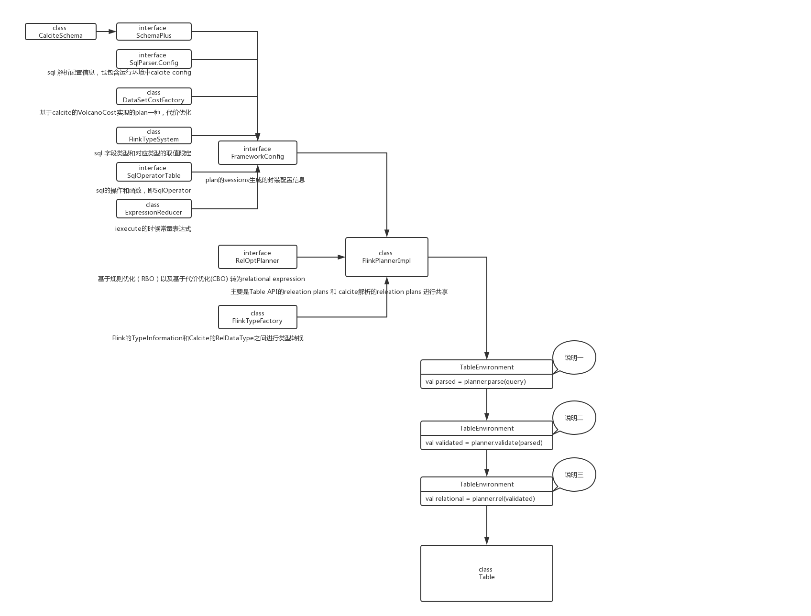
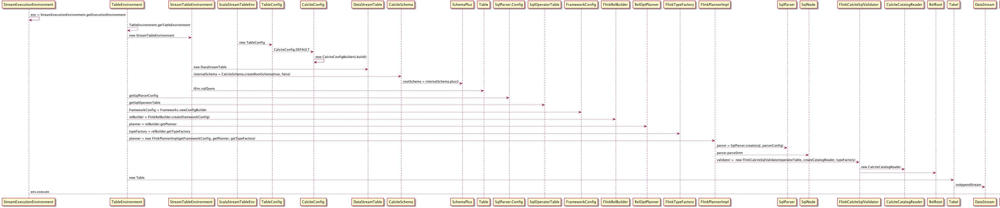

###### StreamSQL转换流程主要是环境准备，DataStream注册，SQL评估，Table转换四部分内容。
#### 一. 环境准备
Flink程序的运行，通常我们都会设置程序执行环境StreamExecutionEnvironment，如standalone模式的LocalStreamEnvironment 或者提交到cluster执行的RemoteStreamEnvironment。而StreamSQL的运行则依赖StreamTableEnvironment，StreamTableEnvironment(继承TableEnvironment)创建代码：  
```scala
val env:StreamExecutionEnvironment = StreamExecutionEnvironment.getExecutionEnvironment  
val tEnv:StreamTableEnvironment = TableEnvironment.getTableEnvironment(env)  
```
getTableEnvironment方法中，其实就是新建一个StreamTableEnvironment对象  
```scala
new StreamTableEnvironment(executionEnvironment,new TableConfig())  
```
在这里也新建了TableConfig，主要是Flink 的Table API运行前的配置信息。这里主要关注calcite对Table API或者sql query的配置信息CalciteConfig，CalciteConfig主要是存储RuleSet信息，包含normRuleSets标准规则,logicalOptRuleSets逻辑执行规则，physicalOptRuleSets物理执行规则，decoRuleSets基于代价优化的执行规则。sql 解析的配置SqlParser.Config，sql操作和函数的SqlOperatorTable。  

SqlParser.Config，SqlOperatorTable实际在TableEnvironment中FrameConfig的时候新创建的，Planner使用的就是就是从FrameConfig获取。  

#### 二. DataStream注册
 以StreamTableEnvironment(继承TableEnvironment)的registerDataStream为例，该方法是将DataStream注册到catalog（calcite通过 CatalogReader被validator和planner读取table metadata）。详细的源码内容有：  
 ```scala
 // class StreamTableEnvironment  
 def registerDataStream[T](name:String,dataStream:DataStream[T],fields:Expression*):Unit={
  	//名称检查，如不能是_DataStreamTable_1等命名
  	checkValidTableName(name)
  	registerDataStreamInternal(name,dataStream.javaStream,fields.toArray)
  }
```
registerDataStreamInternal主要处理：  

	1.抽取字段类型，字段名称，字段角标  
	
	2.验证取dataStream的字段有没有rowtime，proctime，如果有，并注入到字段名称列表和字段角标列表  
	
	3.通过dataStream，字段名称列表，字段角标列表创建DataStreamTable，实际就是calcite的Table  
	
    4.catlog添加表约束，实际代码如下：  
 ```scala
 //class TableEnvironment
 private val internalSchema:CalciteSchema=CalciteSchema.createRootSchema(true,false)
 private val rootSchema:SchemaPlus=internalSchema.plus()
 protected def registerTableInternal(name:String,table:AbstractTable):Unit={
 	if(isRegistered(name)){
 		thrownewTableException(s"Table\'$name\'alreadyexists."+s"Please,chooseadifferentname.")
 	}else{
 		rootSchema.add(name,table)  //这里是重点
 	}
 }
 //判断表已经注册
 protected[flink] def isRegistered(name:String):Boolean={
 	rootSchema.getTableNames.contains(name)
 }
 ```
  在这里有个两个类，CalciteSchema和SchemaPlus都是calcite的原生API，CalciteSchema是用户自定义schema被calcite使用的包装器类，保存Flink所有注册和转化的表，同时禁用了缓存防止副作用。SchemaPlus是Schema接口的丰富，主要提供用户自定义schema或者table的添加，和访问已经添加成功的tables。SchemaPlus只能被用户使用，但是不能由用户实例化，目的是以只读的方式向用户公开calcite注册的schema额外信息。
  
#### 三. SQL评估 
sql语句主要通过TableEnvironment的sqlQuery和sqlUpdate函数进行评估，以sqlQuery为例，主要涵盖：  

    1.创建执行计划对象FlinkPlannerImpl，该类是Flink自己实现替代calcite的PlannerImpl  
    
    2.解析sql语句，返回SqlNode,即解析的语法树  
    
    3.验证SqlNode   
    
    4.SqlNode 转换生成RelRoot,即关系树，是关系表达式RelNode的集合，如SELECT name FROM emp ORDER BY empno DESC的关系树表示是：
```json
RelRoot:{
	rel: Sort($1DESC)
		Project(name,empno)
			TableScan(EMP) 
          fields:[0]
	collation:[1DESC]
}      
 ```
 	其中Sort,Project,TableScan是关系表达式，即RelNode。  
 	
 5.关系表达式封装为逻辑执行计划LogicalRelNode，创建Flink的Table对象。  
 
    代码中涉及类和对象，执行流程详细说明如下： 
 
说明一  

底层是calcite的SqlParser进行parse,返回SqlNode。SqlNode是sql的解析树，涵盖：  

    1.SqlOperator：查询表达式，如distinct，+，-等  
    
    2.SqlLiteral： 类型名称，如NULL，BOOLEAN,DECIMAL等  
    
    3.SqlIdentifier：标识符，如foo.bar，id等  
    
说明二  

采用FlinkCalciteSqlValidator，专门用于FlinkPlannerImpl进行语法树验证，是从Calcite 的CalciteSqlValidator复制过来。主要涉及：  

    1.CatalogScope（实现了SqlValidatorScope接口）：主要是在解析语法树定位标识符的位置，如SqlQualified fqId=scope.fullyQualify(id)  
    
    2.RelDataType ：RelDataType表示从relational expression 返回记录实体或者scalar expression ,如RecordType(BIGINT user, VARCHAR(65536) product, INTEGER amount)  
    
    3.CalciteCatalogReader用于validator和planner读取calcite table的元数据   
    
说明三  

RelRoot是逻辑执行计划树，含有：  

    1.RelNode，即逻辑表达式，如LogicalUnion#6，Sort,Join,Project,Filter,Scan,Sample  
    
    2.RelDataType：即记录实体，如RecordType(BIGINT user, VARCHAR(65536) product, INTEGER amount)  
    
    3.SqlKind  sql节点类型，如Union  
    
    4.RelCollation：物理的关系表达式  
    
    4.操作字段  
    
说明四  

通过RelRoot获取逻辑表达式RelNode，然后封装为LogicalRelNode，是叶子节点类型,接着基于StreamSQL执行环境创建对象Table。  

#### 四. Table转换 
Table除数据输出sink操作外，通常的转换操作有两种：1.直接使用Table封装的API进行数据转换，如select,where等算子；2.转换为DataSet或者DataStream，使用DataStream的API进行转换操作。采用转换为DataStream的toAppendStream为例，详细内容有：  

    1.TableConversions将table转化为DataStream或者DataSet，最终调用的是StreamTableEnvironment的translate方法  
    
    2.translate方法的动作包括：  
    
    	2.1.通过table获取逻辑表达式RelNode  
    	
    	2.2.逻辑表达式是的优化optimize，optimize方法做的是：  
    	  
    	        a. 基于子查询规则，表引用规则采用HepPlanner进行逻辑表达式优化。Calcite实现了两套Planner，HepPlanner和VolcanoPlanner。  
    	    
                b.描述执行计划decorPlan  
            
                c.转化time修饰符，通过RelTimeIndicatorConverter实现  
            
                d.正常的逻辑执行计划  
            
                e.优化逻辑执行计划，即VolcanoPlanner,Flink默认采用该Planner  
            
                f.优化物理执行计划  
            
                g.修饰优化后的计划，然后返回DataStream[CRow]  
            
    3.详细代码：
         
  ```scala
 //class StreamTableEnvironment
 protected def translate[A](
   table:Table,
   queryConfig:StreamQueryConfig,
   updatesAsRetraction:Boolean,
   withChangeFlag:Boolean)(implicittpe:TypeInformation[A]):DataStream[A]={
 	val relNode=table.getRelNode
 	val dataStreamPlan=optimize(relNode,updatesAsRetraction)  
 
 	valrowType=getResultType(relNode,dataStreamPlan)
 
 	translate(dataStreamPlan,rowType,queryConfig,withChangeFlag)
 }
 
 private[flink] def optimize(relNode: RelNode, updatesAsRetraction: Boolean): RelNode = {
 
   // 0. convert sub-queries before query decorrelation
   val convSubQueryPlan = runHepPlanner(
     HepMatchOrder.BOTTOM_UP, FlinkRuleSets.TABLE_SUBQUERY_RULES, relNode, relNode.getTraitSet)
 
   // 0. convert table references
   val fullRelNode = runHepPlanner(
     HepMatchOrder.BOTTOM_UP,
     FlinkRuleSets.TABLE_REF_RULES,
     convSubQueryPlan,
     relNode.getTraitSet)
 
   // 1. decorrelate
   val decorPlan = RelDecorrelator.decorrelateQuery(fullRelNode)
 
   // 2. convert time indicators
   val convPlan = RelTimeIndicatorConverter.convert(decorPlan, getRelBuilder.getRexBuilder)
 
   // 3. normalize the logical plan
   val normRuleSet = getNormRuleSet
   val normalizedPlan = if (normRuleSet.iterator().hasNext) {
     runHepPlanner(HepMatchOrder.BOTTOM_UP, normRuleSet, convPlan, convPlan.getTraitSet)
   } else {
     convPlan
   }
 
   // 4. optimize the logical Flink plan
   val logicalOptRuleSet = getLogicalOptRuleSet
   val logicalOutputProps = relNode.getTraitSet.replace(FlinkConventions.LOGICAL).simplify()
   val logicalPlan = if (logicalOptRuleSet.iterator().hasNext) {
     runVolcanoPlanner(logicalOptRuleSet, normalizedPlan, logicalOutputProps)
   } else {
     normalizedPlan
   }
 
   // 5. optimize the physical Flink plan
   val physicalOptRuleSet = getPhysicalOptRuleSet
   val physicalOutputProps = relNode.getTraitSet.replace(FlinkConventions.DATASTREAM).simplify()
   val physicalPlan = if (physicalOptRuleSet.iterator().hasNext) {
     runVolcanoPlanner(physicalOptRuleSet, logicalPlan, physicalOutputProps)
   } else {
     logicalPlan
   }
 
   // 6. decorate the optimized plan
   val decoRuleSet = getDecoRuleSet
   val decoratedPlan = if (decoRuleSet.iterator().hasNext) {
     val planToDecorate = if (updatesAsRetraction) {
       physicalPlan.copy(
         physicalPlan.getTraitSet.plus(new UpdateAsRetractionTrait(true)),
         physicalPlan.getInputs)
     } else {
       physicalPlan
     }
     runHepPlanner(
       HepMatchOrder.BOTTOM_UP,
       decoRuleSet,
       planToDecorate,
       planToDecorate.getTraitSet)
   } else {
     physicalPlan
   }
 
   decoratedPlan
 }
   ```  
  
  接下来是优化后的计划返回为DataStream[CRow]，详细代码：  
 ```scala 
protected def translateToCRow(
  logicalPlan:RelNode,
  queryConfig:StreamQueryConfig):DataStream[CRow]={

	logicalPlan match{
		case node:DataStreamRel =>
			node.translateToPlan(this,queryConfig) 
		case_=>
			throw TableException("CannotgenerateDataStreamduetoaninvalidlogicalplan."+
				"Thisisabugandshouldnothappen.Pleasefileanissue.")
	}
}

//trait DataStreamRel
def translateToPlan(
  tableEnv:StreamTableEnvironment,
  queryConfig:StreamQueryConfig):DataStream[CRow]
 ```  
 这里的logicalPlan就是我们在说明四的逻辑表达式，如RelNode如果逻辑表达式是Union，则对应转换为实际的Flink执行的逻辑表达式DataStreamUnion（RelNode <-  FlinkRelNode  <-  DataStreamRel <-  DataStreamUnion），代码如下：  
 
```scala 
//class DataStreamUnion(cluster:RelOptCluster,traitSet:RelTraitSet,leftNode:RelNode,rightNode:RelNode,schema:RowSchema)
override deftranslateToPlan(
  tableEnv:StreamTableEnvironment,
  queryConfig:StreamQueryConfig):DataStream[CRow]={

	val leftDataSet=left.asInstanceOf[DataStreamRel].translateToPlan(tableEnv,queryConfig)
	valrightDataSet=right.asInstanceOf[DataStreamRel].translateToPlan(tableEnv,queryConfig)
	leftDataSet.union(rightDataSet)
}
```  
 单逻辑表达式实际就是FlatMap，即DataStreamCalc，通过他对应生成DataStream[CRow]，剩下就是DataStream的核心编程。对应的UM时序图如下：  
 
  

附： calcite的接口和类列表  

    CalciteConfig
    RuleSet  
    SqlOperatorTable
    SqlParser.Config  
    CalciteSchema  
    SchemaPlus  
    RelOptPlanner
    PlannerImpl
    CalciteCatalogReader  
    SqlNode
    RelRoot
    RelNode
    HepPlanner
    VolcanoPlanner